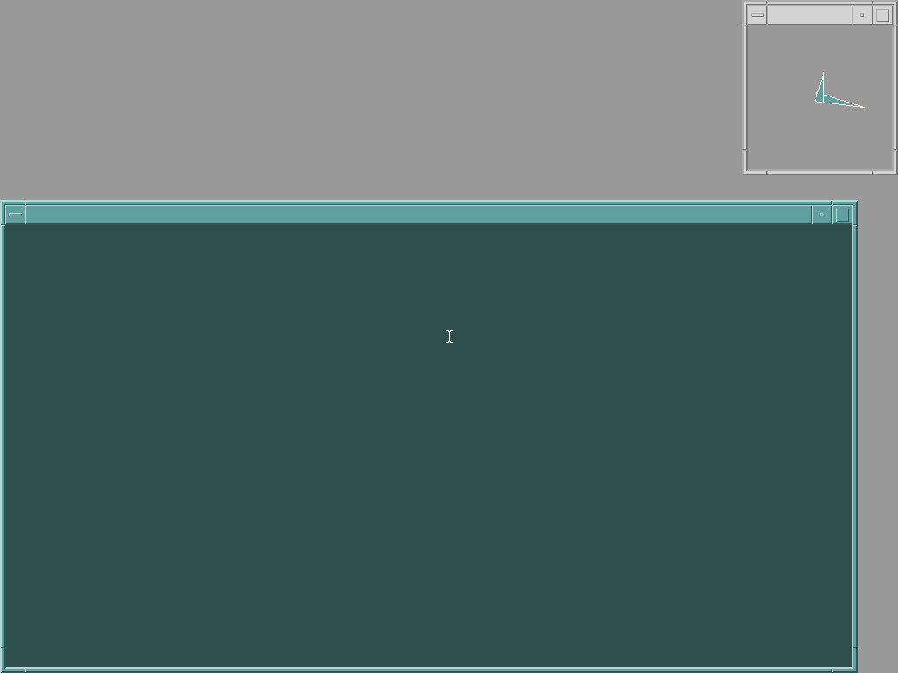

# Adding userland software to the AIX 5L guest

The guest ships with a Minimal install and no network, so there is no `ftp`,
no `wget` and nothing to fetch packages with. This is how to get a modern
userland onto it anyway: build a CD image on the host and mount it inside.

Everything below was run on the guest and the numbers are what it reported.

## Credit

The packages are **not** ours. They are built and maintained by
**[johnsonjh](https://github.com/johnsonjh)** in
**[johnsonjh/AIX5-IA64](https://github.com/johnsonjh/AIX5-IA64)**, a
collection of ready to run precompiled software for AIX 5.1L on Itanium,
built statically to avoid interdependencies. Read that repository's README
before installing anything: it carries the per package notes and errata, and
they are worth having.

Nothing from that repository is redistributed here. The recipe fetches it
straight from the source, so you get whatever the maintainer currently ships.

## Building the CD

Pick the packages you want from the upstream repository. `ncurses` is
recommended in all cases: the curses programs load their terminal definitions
at runtime. `gcc` needs the GNU assembler from `binutils`.

```sh
mkdir -p ports/iso && cd ports/iso
BASE=https://github.com/johnsonjh/AIX5-IA64/raw/refs/heads/master
for f in ncurses-6.3.20211021-1.tar.Z \
         bash-3.2.57.13_123.40.1-1.tar.Z \
         binutils-2.14p2-1.tar.Z \
         gcc-3.1.1-2.tar.Z \
         gmake-3.81_132-1.tar.Z \
         m4-1.4.19-1.tar.Z \
         byacc-20220128-1.tar.Z \
         reflex-20221012-1.tar.Z \
         elvis-2.2.1_pre_20210709_g96648ae-1.tar.Z \
         less-608-1.tar.Z \
         top-3.8beta1p2-1.tar.Z \
         which-2.21-1.tar.Z ; do
    curl -sSLO "$BASE/$f"
done
cd ..
xorriso -as mkisofs -r -J -V AIXPORTS -o aix-ports.iso iso/
```

Rock Ridge (`-r`) is what keeps the long names readable: AIX 5L's `cdrfs`
honours it, and `ls /mnt` shows `bash-3.2.57.13_123.40.1-1.tar.Z` in full
rather than a truncated ISO9660 name.

Boot the guest with the image attached as a second drive:

```sh
  -drive file=aix-ports.iso,media=cdrom,format=raw,readonly=on
```

`cd0` becomes `Available` on its own when the CD is present; no `cfgmgr` run
is needed.

## Installing, on the guest

### Grow /opt first

This is the step that bites. `/opt` ships at 32 MB with 26 MB free, and these
twelve packages need **140 MB** unpacked. Grow it before extracting or the
extraction dies half way through.

**AIX 5.1's `chfs` takes the size in 512-byte blocks and has no `M` or `G`
suffix**; those arrived in 5.2. `chfs -a size=+400M /opt` does not fail, it
quietly grows the filesystem by a single 32 MB partition, which looks like it
worked until the extraction runs out of room. Use blocks:

```sh
chfs -a size=+819200 /opt      # 819200 * 512 = 400 MB
df -k /opt
```

There is room: `rootvg` has 613 free physical partitions, about 19.6 GB.

### Unpack

Every package has a single top level `opt/` with relative paths and no
absolute ones, so unpacking from `/` as root puts everything under
`/opt/freeware` and nothing anywhere else.

```sh
mount -v cdrfs -o ro /dev/cd0 /mnt
cd /
for f in /mnt/*.tar.Z; do compress -dc $f | tar xf - ; done
umount /mnt
```

That takes about twenty minutes under emulation; the decompression is the
slow part.

### Afterwards

```sh
PATH=/opt/freeware/bin:$PATH ; export PATH     # add to /etc/profile to keep it
chown root:system /opt/freeware/bin/top        # top needs to be setuid
chmod u+s /opt/freeware/bin/top
echo /opt/freeware/bin/bash >> /etc/shells
```

If you want `bash` as somebody's **login** shell, it also has to be added to
the `shells =` line of the `usw:` stanza in `/etc/security/login.cfg`. That
file is edited by hand and a mistake in it stops logins working, so it is left
to you rather than done by a script.

## What it looks like when it worked

```
# df -k /opt
Filesystem    1024-blocks      Free %Used    Iused %Iused Mounted on
/dev/hd10opt       458752    312140   32%     3310     5% /opt

# ls /opt/freeware/bin | wc -l
     106

# /opt/freeware/bin/bash --version
GNU bash, version 3.2.57(4)-release (ia64-ibm-aix5.1.0.0)
```

## Running X11

The Minimal install has no X server, but everything needed is on volume 1 of
the medium, so this is an install rather than a port. Only the CJK TrueType
fonts, `X11.compat` and `X11.Dt.other` live on volume 2, and none of them is
needed to start a display.

### Grow /usr first

`/usr` ships 89% full with about 41 MB free and these packages are 50 MB
compressed. Same trap as `/opt` above: blocks, not megabytes.

```sh
chfs -a size=+1638400 /usr        # 1638400 * 512 = 800 MB
```

### Install

```sh
mount -v cdrfs -o ro /dev/cd0 /mnt
installp -acgXd /mnt/installp/ia64 \
    X11.base X11.fnt X11.apps X11.motif \
    devices.pci.02104552 devices.pci.02104b52
```

The two `devices.pci.*` filesets are the display drivers, and their `.X11`
parts are the ddx modules the X server loads. This also fixes `elvis`, which
is built with X11 support and until now died with
`could not find or could not open libX11.so`.

### The display id has to match, and by default it does not

The X server binds its ddx module to the adapter **by PCI id, through the
ODM**. Started against the emulated Rage 128 Pro it stops with:

```
1362-009 The X Server is unable to locate display PCI ID: 1002 5046 ...
1362-012 Cannot set ddx module name from ODM.
1356-800 xinit: Unable to start the X server
```

The ddx modules on the medium cover `1002:5245` and `1002:524b`, the Rage 128
RE and RK. There is none for `1002:5046`, the Pro, which is what the model
implements. Note the filesets named "Pro GL" and "Pro VR" do not help: their
ids are `1002:0008` and `1002:0068`, which are not the Pro's PCI id.

The machine option **`ati-rage128=on`** closes the gap. It rewrites only the
id in config space and leaves the model's own `dev_id` alone, so every
register path still behaves as the Rage 128 Pro it emulates and the earlier
part's driver can drive it. Same shape of fix as `scsi-895`, and for the same
reason: the guest ships one id per family and will not look past it.

```sh
  -machine ia64-vpc,ahci=off,scsi-895=on,isa-bridge=on,ati-rage128=on,...
```

With that, `cfgmgr` binds the native driver and the generic VGA steps aside:

```
vga0   Defined    00-28   Generic VGA Device
rage0  Available  00-28   ATI Rage128 PCI Graphics Adapter
```

`xinit` then brings up a Motif desktop at 1024x768, and the text console goes
from 640x400 to 1024x768 as well.



### Two profiles

Both work, and which one to build is a choice about the disk rather than
about the emulator: the option is off by default, so a minimal guest never
sees it.

| | Minimal | With X |
|---|---|---|
| install | `INSTALL_CONFIGURATION = Minimal` | the same, plus the filesets above |
| disk used | about 394 MB | about 700 MB |
| `/usr` | as shipped | grown by 800 MB |
| machine options | `scsi-895`, `isa-bridge` | the same, plus `ati-rage128` |
| console | LFT text at 640x400 | LFT text at 1024x768, and X |

## Notes worth repeating from upstream

* Packages are statically built, so they do not depend on each other.
* Some binaries are renamed where the system tool must not be shadowed, which
  is why it is `gmake` and not `make`.
* The compiler has known bugs and there is no debugger. A successful
  compilation does not mean a working binary; test what you build.
* `openssh` is packaged and works, but only with public key authentication,
  and it needs an `sshd` user and group set up by hand. It is moot on this
  machine until the network works, which it does not yet.

The full and current list of caveats lives in the
[upstream README](https://github.com/johnsonjh/AIX5-IA64), which is the
authority; this page only records what was needed to get the packages onto a
guest with no network.
